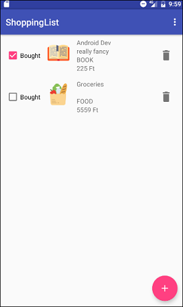

# Android example applications

Homework
=================================
> TODO list application. You can add and categorize TODOs. After you completed one, you can view it in the History tab.
> Technologies:
 * SugarORM
 * Recycler View
 * Fragments
  * Dialog fragment
 * Toolbar
 * ViewPager
 

Examples
=================================
1. <b>Android Wallet</b> 
> A simple wallet application, where you can log your income/expenses
> Technologies:
 * Activity
 * Layouts
 	* LayoutInflater
 * LinearLayout
 * TextView, ImageView, EditText, Button

2. <b>Shopping List</b> 
> 
> Technologies:
 * Fragment
 * RecyclerView
 * FloatingActionButton
 * SugarORM
   

3. <b>Wheather Info</b> 
> You can add and click on cities to view detailed weather info.
> Technologies:
 * ViewPager
 * Retrofit
 * Glide
 

 
